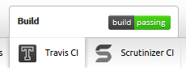
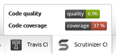

CIBundle (Continuous Integration Bundle)
========================================

[](https://packagist.org/packages/cleentfaar/ci-bundle)


## So, what does this little thingie do?

It adds extra sections to your Symfony Web Debug Toolbar related to continuous integration of your project:


By hovering over each item in the toolbar, you can see the badges of each CI service for your project





Currently, the following collectors are built-in:
+ **Travis** : Shows the badge of the latest result of your Travis tests
+ **Scrutinizer** : Shows the latest result of your Scrutinizer tests (code quality and coverage)
+ ... more coming soon! If you have ideas yourself, send them in (create a new issue with label 'enhancement')!


## Requirements

+ Your project uses Symfony (what else?)
+ You have hosted your project on GitHub, and you working on a clone of project (there is a .git directory in the root)
+ Optional: You have connected the service hooks from either Travis CI or Scrutinizer CI (or both!) to your GitHub
repository so you don't have to run tests manually on each modification
+ Mandatory: You have bought yourself a nice chocolate cake to celebrate seeing all your favorite tools coming together :)

If you have your Symfony project hosted on GitHub, but not yet connected to either of the services; there are plenty of
guides out there to get this going, and it really is dead simple so *do* go for it!


## Installation

Add this in your `composer.json`

    "require-dev": {
        [...]
        "cleentfaar/ci-bundle" : "dev-master"
    },

Then run `php composer.phar update cleentfaar/ci-bundle`


### Register the bundle in your AppKernel (`app/AppKernel.php`)

Most of the time, we need this bundle to be only activated in the `dev` environment

    [...]
    if (in_array($this->getEnvironment(), array('dev', 'test'))) {
        [...]
        $bundles[] = new Cleentfaar\CIBundle\CleentfaarCIBundle();
    }


### Activate the collectors you want to use through your config_dev.yml

The collectors can be used independently, and can be enabled/disabled through configuration as illustrated below.


#### Quick configuration

Since most of the configuration has sensible defaults, you only need the below configuration to use all collectors

```yaml
    # config_dev.yml
    cleentfaar_ci:
        travis: true
        scrutinizer:
            shields:
                quality:
                    hash: YOUR_QUALITY_BADGE_HASH_HERE
                coverage:
                    hash: YOUR_COVERAGE_BADGE_HASH_HERE
```

**NOTE:** As you can see in the example above, a hash is required for Scrutinizer's badges to be displayed for your project
To get the hashes, simply log-in to your Scrutinizer Dashboard, and locate the badge examples displayed on the right.
If you click on the information icon next to it you will get the source code of each badge. At the end of the image's URL
 is the hash you will need to enter in this configuration.


#### Full configuration example

Below you can see a full reference of the current configuration options. Note that more options will become available as
functionality increases.

    cleentfaar_ci:
        travis:
            enabled:            false
            shields:
                build:
                    enabled:    true
        scrutinizer:
            enabled:            false
            shields:
                quality:
                    hash: YOUR_QUALITY_BADGE_HASH_HERE
                coverage:
                    hash: YOUR_COVERAGE_BADGE_HASH_HERE
