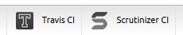

CIBundle
========================================

[](https://packagist.org/packages/cleentfaar/ci-bundle)
[](https://scrutinizer-ci.com/g/cleentfaar/CleentfaarCIBundle/)
[](https://scrutinizer-ci.com/g/cleentfaar/CleentfaarCIBundle/)
[](http://travis-ci.org/cleentfaar/CleentfaarCIBundle)
[](https://packagist.org/packages/cleentfaar/ci-bundle)


# So, what does this little thingie do?

It adds extra sections to your Symfony Web Debug Toolbar related to continuous integration of your project:



By hovering over each item in the toolbar, you can see the badges of each CI service for your project


Currently, the following collectors are built-in:
+ **Travis** : Shows the badge of the latest result of your Travis tests
+ **Scrutinizer** : Shows the latest result of your Scrutinizer tests (code quality and coverage)
+ ... more coming soon! If you have ideas yourself, send them in (create a new issue with label 'enhancement')!


# Requirements

+ Your project uses Symfony (what else?)
+ You have hosted your project on GitHub, and you working on a clone of project (there is a .git directory in the root)
+ Optional: You have connected the service hooks from either Travis CI or Scrutinizer CI (or both!) to your GitHub
repository so you don't have to run tests manually on each modification
+ Mandatory: You have bought yourself a nice chocolate cake to celebrate seeing all your favorite tools coming together :)

If you have your Symfony project hosted on GitHub, but not yet connected to either of the services; there are plenty of
guides out there to get this going, and it really is dead simple so *do* go for it!


# Installation

Add this in your `composer.json`

    "require-dev": {
        [...]
        "cleentfaar/ci-bundle" : "dev-master"
    },

Then run `php composer.phar update cleentfaar/ci-bundle`


### Register the bundle in your AppKernel

Most of the time, we need this bundle to be only activated in the `dev` environment

```php
// app/AppKernel.php
[...]
if (in_array($this->getEnvironment(), array('dev', 'test'))) {
    [...]
    $bundles[] = new Cleentfaar\CIBundle\CleentfaarCIBundle();
}
```

### Activate the collectors you want to use

The collectors can be used independently, and can be enabled/disabled through configuration as illustrated below.
Since you should this bundle mostly through the dev-environment, I suggest you add them to ``config_dev.yml``


### Quick configuration

Since most of the configuration has sensible defaults, you only need the below configuration to use all collectors

```yaml
# app/config/config_dev.yml
cleentfaar_ci:
    travis: true
    scrutinizer:
        shields:
            quality:
                hash: YOUR_QUALITY_BADGE_HASH_HERE
            coverage:
                hash: YOUR_COVERAGE_BADGE_HASH_HERE
```

#### About the hash
As you can see in the example above, a hash is required for Scrutinizer's badges to be displayed for your project.

To get the hashes, simply log-in to your Scrutinizer Dashboard, and locate the badge examples displayed on the right.

If you click on the information icon next to it you will get the source code of each badge. At the end of the image's URL is the hash you will need to enter in this configuration.

Another advice is that you use a parameter to fill the actual value in your app/config/config_dev.yml-file. 
The reason for this is that if you are working on a project with more than one developer, you are bound to be working on different branches at one time or another. Since the badges are  team on the same project Even though there may not be any danger in sharing this number in public;

Here is an example:

```yaml
# app/config/config_dev.yml
cleentfaar_ci:
    travis: true
    scrutinizer:
        shields:
            quality:
                hash: %my_app.scrutinizer.quality_hash%
            coverage:
                hash: %my_app.scrutinizer.coverage_hash%
```

And then in your parameters.yml (should be unversioned, so that helps):

```yaml
# app/config/parameters.yml
parameters:
    ...
    my_app.scrutinizer.quality_hash: 123456789abcdefgh
    my_app.scrutinizer.coverage_hash: 123456789abcdefgh
    ...
```

Obviously, in the last example you *should* replace the values with the ones from your Scrutinizer Dashboard


### Full configuration example

Below you can see a full reference of the current configuration options. Note that more options will become available as functionality increases.

```yaml
cleentfaar_ci:
    travis:
        enabled:            false
        shields:
            build:
                enabled:    true
    scrutinizer:
        enabled:            false
        shields:
            quality:
                hash: YOUR_QUALITY_BADGE_HASH_HERE
            coverage:
                hash: YOUR_COVERAGE_BADGE_HASH_HERE
```

# Coming soon

+ Detailed panel views of each service in the debug page to indicate results from tests directly through use of the API's and graphs
+ More configuration options, especially to authenticate with the different API's for more detailed results
+ Your idea here!

## Summary

In the near future I would like to integrate these services into the actual panels that are used on the detail page
(page you see when you click on other toolbar items).

I'm thinking of using the API's made for both Travis and Scrutinizer to display some quick graphs and some testing results, all directly accessible under your favorite toolbar!
